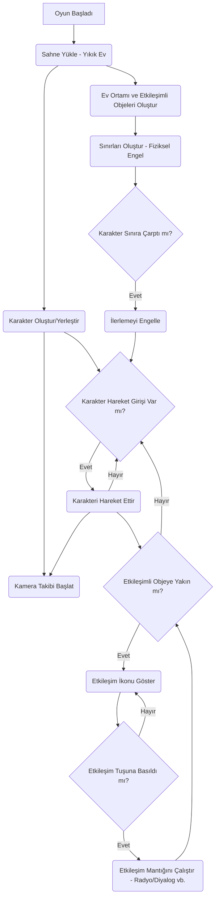

# "Apocalyptic Courier" Oyunu Geliştirme Planı (Güncellenmiş Odak)

**Hedef:** Kıyamet sonrası bir dünyada, akli dengesi yerinde olmayan bir kuryenin, siparişini teslim etmek için yatay olarak ilerlediği 2D free-roam bir oyun oluşturmak. İlk aşamada oyunun başlangıç atmosferi, yıkık ev ortamındaki etkileşimli objeler ve karakterin dünyayı farklı algılamasını yansıtan diyaloglar üzerine odaklanılacaktır. Temel savaş mekanikleri (mermi sektirme, can sistemi) daha sonra entegre edilecektir.

**Aşamalar:**

1.  **Başlangıç Sahnesi (Yıkık Ev) Tasarımı ve Kurulumu:**
    *   Oyuncunun başladığı yıkık ev ortamını temsil eden bir Unity sahnesi oluşturulacak.
    *   Sahneye görsel öğeler (Sprite'lar, Tilemap'ler) eklenerek yıkık, kıyamet sonrası ev atmosferi yaratılacak.
    *   Karakter (motosikletli adam görseli ile) sahneye yerleştirilecek.
    *   Kameranın karakteri yatay eksende takip etmesini sağlayan basit bir kamera takip scripti oluşturulup eklenecek.

2.  **Etkileşimli Objeler ve Çevre Etkileşimi:**
    *   Ev ortamına etkileşime girilebilecek objeler yerleştirilecek (örneğin, radyo, kırık eşyalar, notlar).
    *   Etkileşimli objeler için bir tespit mekanizması oluşturulacak (örneğin, karaktere yakınlaştığında veya belirli bir tuşa basıldığında etkileşim ikonu belirme).
    *   Radyo gibi objeler için etkileşim mantığı uygulanacak (örneğin, radyoya tıklayınca oyun müziğinin değişmesi). Başka etkileşim önerileri de değerlendirilecek (örneğin, bir objeyi inceleyince karakterin yorum yapması).

3.  **Karakter Diyalog Sistemi:**
    *   Düşmanlarla karşılaşıldığında veya belirli etkileşimli objelerle etkileşime girildiğinde karakterin diyalog balonu veya metin göstermesini sağlayan basit bir sistem oluşturulacak.
    *   Bu diyaloglar, karakterin akli dengesinin yerinde olmadığını ve dünyayı farklı algıladığını yansıtacak (Deadpool tarzı alaycı/komik yorumlar).
    *   Diyalog metinleri için bir yapı oluşturulacak (örneğin, bir metin dosyası veya scriptable object).

4.  **Temel Karakter Hareketi ve Sınırlar:**
    *   `PlayerController.cs` scripti, karakterin ekranın sol yarısı kısıtlaması olmadan yatayda serbestçe hareket etmesini sağlayacak şekilde güncellenecek.
    *   Ev ortamının sınırları için fiziksel engel görevi görecek sınırlar oluşturulacak (görünmez duvarlar). Çarpmak hasar vermeyecek, sadece ilerlemeyi engelleyecek.

5.  **Temel Savaş Mekaniklerinin Entegrasyonu (Sonraki Aşama):**
    *   `PlayerHealth.cs`, `Enemy.cs`, `EnemyProjectile.cs` scriptleri ve ilgili prefablar (düşman, mermi, kalkan) bu aşamada mevcut tutulacak ancak ilk odak noktası olmayacak.
    *   Ev ortamından dış dünyaya geçiş sağlandığında düşmanlarla karşılaşma ve savaş mekanikleri entegre edilecek.

**Mermaid Diyagramı (Güncellenmiş Akış - Başlangıç Odaklı):**

Bu güncellenmiş plan, ilk aşamada odaklanmak istediğimiz alanları daha net belirtiyor. Bu plan sana uygun mu? Üzerinde eklemek, çıkarmak veya değiştirmek istediğin başka bir şey var mı?